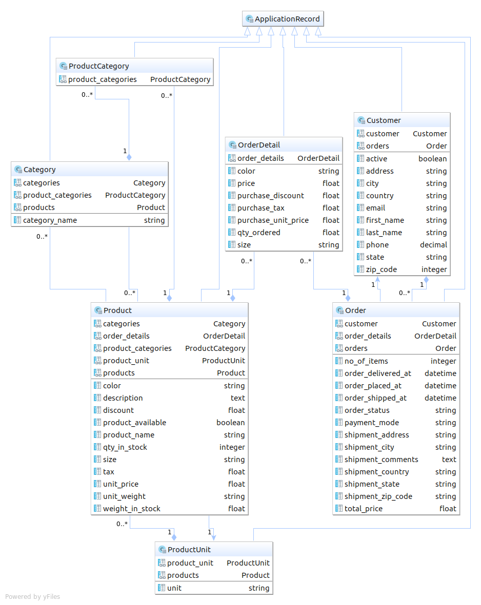

# README
### Heroku --> https://order-report-api.herokuapp.com/report

#### Rails API to generate reports for the following
 1) Customers order history based on categories
 2) Daily/weekly/monthly report showing the product sold history
 3) Order details of a specific customer
 
 #### Assumptions made:
 ##### The requirements didn't specify whether to create application only with given tables. 
 So I assumed and normalized with few additional table relations.
 
 ##### The product summary report based on day range and day/week/month.
 I created api to run reports to fetch all product history based on day/week/month.
 Also one more endpoint to run report to fetch the same with date range.
 
 ##### A product belongs to many categories. A category has many products. 
 Here I created many to many relationship with additional table product_category to store  all the relations.
 
 #### I'll accomplish with extra time
 1) I'll optimize the json response 
 2) Refactor fat model with additional service layer.
 3) Cover more test cases
 4) Add validations to user params
 5) Write more data validations
 
 #### API endpoints
 ```
 GET /report                                                  ===>  'Get category based customer report'
 GET /report/daily                                            ===>  'Get daily report on product-wise'
 GET /report/weekly                                           ===>  'Get weekly report on product-wise'
 GET /report/monthly                                          ===>  'Get monthly report on product-wise'
 GET /report/daily/10-10-2017/28-12-2017                      ===> 'Get product-wise daily report within date range'
 GET /report/weekly/10-10-2017/28-12-2017                     ===> 'Get product-wise weekly report within date range'
 GET /report/monthly/10-10-2017/28-12-2017                    ===> 'Get product-wise monthly report within date range'
 GET /report/customer/4                                       ===>  'Get order details of a customer'
 GET /report/daily/export                                     ===> 'Export daily report to CSV'
 GET /report/weekly/export                                    ===> 'Export weekly report to CSV'
 GET /report/monthly/export                                   ===> 'Export monthly report to CSV'
 GET /report/daily/10-10-2017/28-12-2017/export               ===> 'Export date range daily report to CSV'
 GET /report/weekly/10-10-2017/28-12-2017/export              ===> 'Export date range weekly report to CSV'
 GET /report/monthly/10-10-2017/28-12-2017/export             ===> 'Exprot date range monthly report to CSV'
 
```

##### We want to give customers the ability to create lists of products for a one-click ordering of bulk items. How would you design the tables, what are the pros and cons of your approach?

I have created my application to accomodate bulk ordering in one click. With this design, user can order bulk items of individual product on cart. Oracle E-Commerce database is designed with this feature. It has order header which will have number of line items ordered under the order which is by de-normalization. The other table will be line relation which holds the information about the product information.
User can simply pick a product specify the bulk order counts and repeating the same process, user will be able to order bulk items with one click.

##### When facing a high traffic and limited supply of a particular item, how do you distribute the inventory among customers checking out?
We can distribute the items, that are on high demand by restricting with a time frame. If a product is on high demand, we could notify the user that the product will be added in the cart and will be alive only for certain duration after which the product can be left available on stock again for other customers. Customer with first come will be served first. Or, on the other way, we use prioritize the customer order based on customer ranking. Customer with high ranking should be prioritized first for the on-demand product. This way, we can create competition among customers to shop more to improve their ranking, so that they get prioritized on high demand product.

  
